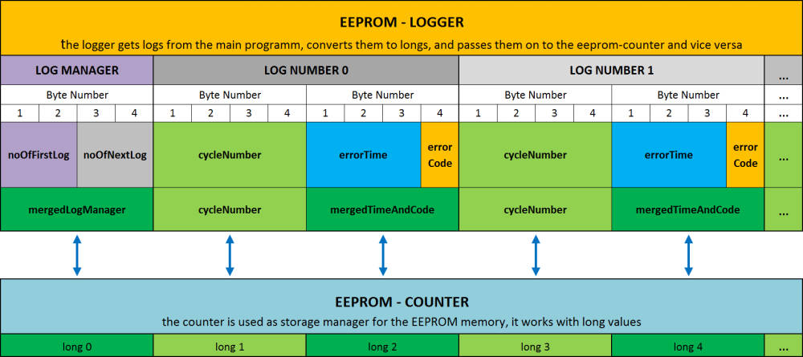

# eeprom-logger-library 

**Library to store logs on the non volatile Arduino EEPROM memory.**

Readme explanations and example code of the library handle the library as an error-log-library, the usage of the library is of course not limited to this purpose. 

The "eeprom-logger-library" makes use of the "eeprom-counter-library" to handle the eeprom read/write commands and to take care that the memory has an evenly wear off and therefore a longer lifetime.
Additional information regarding the eeprom-counter-library can be found here:
https://github.com/chischte/eeprom-counter-library.git

**The Information stored with the eeprom-error function are:** 
errorCode  ...what error did happen
 
cycleNo    ...at what tool cycle did the error happen? 

errorTime  ...at what time since the last reset did the error happen 
 
**Memory usage** 
Each error entry takes up 2 long values = 8 bytes. 
 
The 1st long is split into 1byte for the Error Code and 3 bytes for the time 

The 2nd long (4bytes) stores the cycle number. 

An Additional long is used to store which slot is currently in use. 

6 additional bytes are used by the counter-library

**Memory requirements**

Therefore to store 100 error logs, a total of 810 bytes is required: 

	100 x 8bytes + 4 bytes     + 6 bytes 
	log entries  + currentSlot + counter-library
	
   
**Value Ranges** 

error code:   256 possible codes

error time:   about 49 days if interpreted as seconds (millis overflow), about 4.7 hours if interpreted as milliseconds 

cycle number: about 2 billion cycles (signed long) 
 

Library Functions
-----------------

	// CREATE AN INSTANCE OF THE LIBRARY CLASS:
	EEPROM_Logger exampleErrorLogger(int eepromMinAddress, int eepromMaxAddress, int numberOfValues); 

 **An example of how the functions can be used can be found in the example code.**	
  

Installation
------------
The Library can be installed by cloning or downloading it to Arduinos default library location, e.g. user/documents/Arduino/libraries/.
